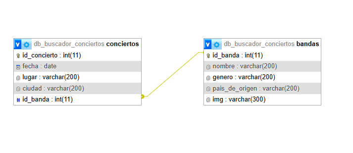

# Buscador de Conciertos

## Integrantes
- German Hernandez (germanhernandez2026@gmail.com)
- Juan Bautista Cuchiarelli (jcuchiarelli@alumnos.exa.unice.edu.ar)

## Temática

Web de búsqueda de conciertos de bandas musicales.

## Descripción

El sistema permitirá buscar información sobre bandas musicales y los conciertos que realizan.En la base de datos se guardarán datos como el nombre de la banda, el lugar del concierto, la fecha y los precios. Una banda puede tener muchos conciertos (relacion 1N), pero cada concierto pertenece a una sola banda. 

## Diagrama de entidad relación (DER)

