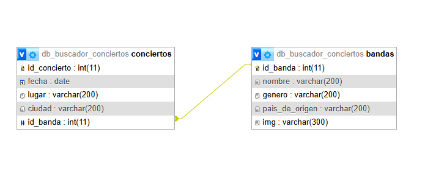

# Buscador de Conciertos

## Integrantes
- German Hernandez (germanhernandez2026@gmail.com)
- Juan Bautista Cuchiarelli (jcuchiarelli@alumnos.exa.unice.edu.ar)

## Temática

Web de búsqueda de conciertos de bandas musicales.

## Descripción

El sistema permitirá buscar información sobre bandas musicales y los conciertos que realizan.En la base de datos se guardarán datos como el nombre de la banda, el lugar del concierto, la fecha y los precios. Una banda puede tener muchos conciertos (relacion 1N), pero cada concierto pertenece a una sola banda. 

## Diagrama de entidad relación (DER)

## Rol de cada integrante

-Germán (Rol A)**: Desarrollo de la entidad N (Conciertos), CRUD completo de ítems con selección dinámica de categorías, sistema de enrutamiento base, control de acceso mediante sesiones y procesamiento del inicio de sesión (Login administrador).
-Juan (Rol B)**: Desarrollo de la entidad 1 (Bandas), CRUD completo de categorías, listado público de categorías e ítems filtrados por categoría, y funcionalidad de cierre de sesión (Logout).

### Usuario y Clave para administrador

Para acceder a las secciones privadas de administración y testing del sitio (`/admin-conciertos`), utilice los siguientes datos requeridos en la consigna:
-**Usuario:** `webadmin`
-**Contraseña:** `admin`